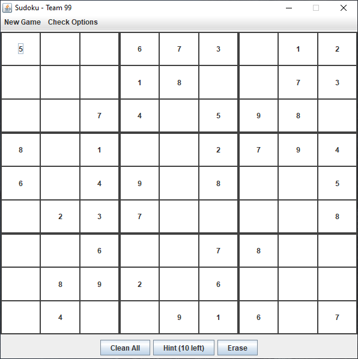

# The Sudoku Game - Team 99
___

### Names of the members of your team
Jinhuang Lin, linjin@seas.upenn.edu
Qianfan Yu, qianfan@seas.upenn.edu
Qixiu Quan, atlasq@seas.upenn.edu
___

### High level description of the project
We plan to build a desktop Sudoku application that can random generate sudoku board based on the difficulty selected by the player and suggest next moves as per player’s request. 
___

### A short work breakdown
Jinhuang: GUI development, JUnit test;
Qianfan: Development of Sudoku number table, suggestor, input validator , number class;
Qixiu: GUI development and Game Logic.
___

### Recommended environment
#### OS
```
Windows 10
```
#### Java version
```
java version "1.8.0_241"
Java(TM) SE Runtime Environment (build 1.8.0_241-b07)
Java HotSpot(TM) 64-Bit Server VM (build 25.241-b07, mixed mode)
```
#### Package dependencies
```
javax.swing
org.junit
```
___

### How to run the game
In order to run the game, first, we suggest user to setup your local environment as recommened above. And then simply compile and run the .java file: 
```
Sudoku.java
```
If successful, the following Game window will pop up. Enjoy the game!


___

